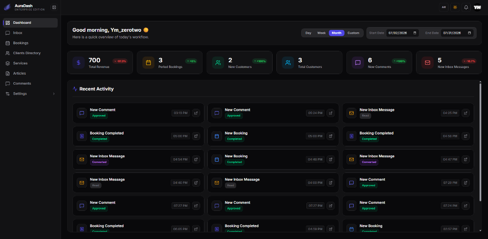

<p align="center">
  
</p>

<h1 align="center">AuraDash</h1>
<p align="center"><strong>A Full-Stack Business Management Dashboard for Service-Based Businesses</strong></p>

<p align="center">
  <a href="https://nextjs.org/"></a>
  <a href="https://react.dev/"></a>
  <a href="https://hono.dev/"></a>
  <a href="https://workers.cloudflare.com/"></a>
  <a href="https://zustand-demo.pmnd.rs/"></a>
  <a href="#"></a>
</p>

<p align="center">
  <a href="https://www.youtube.com/@Ym_zerotwo">
    
  </a>
</p>

<br />



---

## 📖 Project Overview

**AuraDash** is a highly optimized, dual-locale (English/Arabic) business management solution designed for service providers. It combines a robust React/Next.js frontend with a blazing-fast, edge-native Cloudflare Workers backend powered by Hono. 

Distributed via `npx create-auradash my-app`, AuraDash delivers enterprise-grade features including role-based access control (RBAC), multi-layered security, real-time state polling, and comprehensive media/article management right out of the box.

For complete documentation, visit our [official documentation site](https://auradash.ymzerotwo.com).

---

## 📋 Table of Contents

- [📖 Project Overview](#-project-overview)
- [🛠️ Real Tech Stack](#%EF%B8%8F-real-tech-stack)
- [☁️ Infrastructure & Cloudflare Bindings](#%EF%B8%8F-infrastructure--cloudflare-bindings)
- [💰 Ultra-Low Operating Cost & Enterprise Value ($5/mo)](#-ultra-low-operating-cost--enterprise-value-5mo)
- [🔐 Security & Authentication Architecture](#-security--authentication-architecture)
- [🔀 Data Flow & System Architecture](#-data-flow--system-architecture)
  - [1️⃣ Dashboard System Flow](#1%EF%B8%8F%E2%83%93-dashboard-system-flow)
  - [2️⃣ Public Website API Flow](#2%EF%B8%8F%E2%83%93-public-website-api-flow)
  - [3️⃣ Static Media Streaming Flow](#3%EF%B8%8F%E2%83%93-static-media-streaming-flow)
- [📂 Project Structure](#-project-structure)
- [🚨 Default Credentials Security Warning](#-critical-security-warning--default-credentials)
- [🌐 Standard API Envelope](#-standard-api-envelope)
- [🚦 Core API Routes](#-core-api-routes)
- [🌍 i18n Implementation](#-i18n-internationalization-implementation)
- [🤖 Headless & AI-Powered Custom Frontends](#-headless--ai-powered-custom-frontends)
- [⚙️ Development Setup](#%EF%B8%8F-development-setup)
- [🧪 Testing & 🚀 Deployment](#-testing---deployment)
- [💼 Custom Solutions & Enterprise Setup](#-custom-solutions--enterprise-setup)
- [📄 License & Intellectual Property](#-license--intellectual-property)

---

## 🛠️ Real Tech Stack

### Frontend (`auradash-dashboard` v1.0.0)
- **Framework:** Next.js `^16.2.4`, React `^19.2.4`
- **State Management:** Zustand `^5.0.12`, React Query `^5.100.8`
- **UI Components:** Shadcn UI `^4.5.0`, Base UI `^1.4.1`, Tailwind CSS `^4`, Next Themes `^0.4.6`
- **Validation:** Zod `^4.4.1`
- **Icons & Typography:** Lucide React `^1.11.0`, React Icons `^5.6.0`, Inter, Cairo, JetBrains Mono
- **Tooling:** ESLint `^9.20.0`, TypeScript `^5`

### Backend (`auradash-backend`)
- **Framework:** Hono `^4.12.15`
- **Validation & Parsing:** Zod `^4.4.1`, `@hono/zod-validator` `^0.7.6`, sanitize-html `^2.17.4`
- **Infrastructure:** Cloudflare Workers `^6.3.0`, Wrangler `^4.114.0`
- **Testing:** Vitest `^4.1.8`, `@cloudflare/vitest-pool-workers`, Coverage Istanbul

---

## ☁️ Infrastructure & Cloudflare Bindings

AuraDash leverages Cloudflare's ecosystem for an edge-first architecture, configured in `wrangler.jsonc`:

| Resource | Binding Name | Purpose |
|----------|-------------|---------|
| **D1 Database** | `DB` | Main relational database (`auradash`) |
| **R2 Bucket** | `STORAGE` | Asset and media storage (`auradash-storage`) |
| **KV Namespace**| `K1` | Session storage, high-speed caching |
| **Email** | `EMAILER` | Transactional email delivery |
| **Cron Triggers**| `0 3 * * *` | Daily background tasks (3:00 AM UTC) |

### Rate Limiters
We enforce strict rate limits natively via Cloudflare:
- `PUBLIC_LIMITER`: 25 req/60s
- `AUTH_LIMITER`: 3 req/60s
- `DASHBOARD_LIMITER`: 100 req/60s
- `LOGIN_RECOVERY_LIMITER`: 5 req/60s
- `VERIFY_CODE_LIMITER`: 5 req/60s
- `STATE_LIMITER`: 60 req/60s
- `NOTIFICATIONS_LIMITER`: 40 req/60s
- `PUBLIC_SUBMISSION_LIMITER`: 2 req/60s
- `FILES_LIMITER`: 200 req/60s ⚠️ **[INACTIVE — Files served via R2 Public URL]**
- `HEALTH_LIMITER`: 30 req/60s

---

## 💰 Ultra-Low Operating Cost & Enterprise Value ($5/mo)

AuraDash is engineered to run on **Cloudflare Workers Paid Plan ($5/month)**, delivering enterprise-grade cloud infrastructure that replaces $100+/month traditional AWS or GCP setups.

### 🌟 Why the $5/month Plan is a Massive Advantage

For just **$5/month flat**, AuraDash unlocks powerful edge features that typically require expensive third-party services:

- 📧 **Native Transactional Emailing (`EMAILER` Binding)**: Built-in integration with Cloudflare Email Routing to dispatch OTP codes, password resets, and contact inquiries without paying for external providers (SendGrid, Mailgun, Postmark).
- ⚡ **10 Million Edge Requests/Month**: Massive request quota included with zero cold starts and global low-latency routing across 300+ edge cities.
- 🔒 **Native Edge Rate Limiting**: Hardware-level protection across all API endpoints (`AUTH_LIMITER`, `PUBLIC_LIMITER`, `DASHBOARD_LIMITER`).
- 🗄️ **Zero Egress Fee R2 Media Storage**: Stream and store media assets with **$0 data transfer fees**, completely eliminating the bandwidth bills associated with AWS S3.
- 🚀 **Expanded CPU Time (30ms–50ms)**: Enables PBKDF2 WebCrypto password hashing (600,000 iterations) and strict Zod validation without timeouts.

### 📊 Cost Comparison

| Cloud Service | Traditional Stack (AWS / Heroku / SendGrid) | AuraDash Cloudflare Stack |
|---|---|---|
| **Compute / API** | AWS EC2 / App Runner (~$20–$50/mo) | Cloudflare Workers: **Included** |
| **Relational DB** | AWS RDS / Supabase Pro (~$25–$60/mo) | Cloudflare D1 (SQLite DB): **Included** |
| **Cache / Sessions** | Redis / ElastiCache (~$15–$30/mo) | Cloudflare KV: **Included** |
| **Media / CDN** | AWS S3 + Egress Fees (~$10–$30+/mo) | Cloudflare R2 ($0 Egress): **Included** |
| **Transactional Email** | SendGrid / Mailgun (~$15–$35/mo) | Cloudflare Email Routing: **Included** |
| **TOTAL COST** | 💸 **$85 – $200+/month** | 🎉 **ONLY $5/month flat** |

---

## 🔐 Security & Authentication Architecture

AuraDash takes security seriously, combining modern patterns to protect user data and administrative endpoints.

- **Password Hashing:** PBKDF2-SHA256 (600,000 iterations) using Web Crypto API.
- **Session Management:** KV-backed sessions (`session:<uuid>`) tracked via the `session_id` cookie.
- **CSRF Protection:** Double Submit Cookie pattern utilizing `csrf_token` and `x-csrf-token` securely validated via `timingSafeEqual()`.
- **API Keys:** HMAC-SHA256 signed. Production keys (`auradash_pk`) are domain-bound; Test keys (`auradash_ts`) expire in 24 hours.
- **Hijacking Prevention:** Aggressive IP and User-Agent fingerprint validation.
- **Input Sanitization:** Zod v4 schemas + `sanitize-html`.
- **RBAC:** Dynamic JSON path traversal to map user permissions, protected against prototype pollution (`__proto__`, `constructor`, `prototype` blocked).

### Middleware Pipeline
1. Unique Request ID Generation
2. Secure Headers (HSTS, CSP, X-Frame-Options: DENY, X-Content-Type-Options: nosniff)
3. Dynamic Body Limits (2MB for APIs, 100MB for Media Uploads)
4. Origin/Referer verification against `ALLOWED_ORIGINS`
5. Route-Specific Handlers: Session/KV verification, Edge Caching, CSRF matching, RBAC checking.

---

## 🔀 Data Flow & System Architecture

AuraDash is engineered around three isolated, independent architectural subsystems:

---

### 1️⃣ Dashboard System Flow

A **Stateful, Session-Backed** pipeline protecting administrative actions with RBAC, CSRF, and session validation against Cloudflare KV (`K1`).

```
┌──────────────────────────────────────────────────────────────────┐
│                   Next.js 16 Dashboard Frontend                  │
│                   (App Router / Client Components)               │
└─────────────────────────────────┬────────────────────────────────┘
                                  │
                   HTTPS Request to /api/*
                   Cookies: session_id, csrf_token
                   Headers: x-csrf-token, Origin/Referer
                                  │
                                  ▼
┌──────────────────────────────────────────────────────────────────┐
│                    Cloudflare Worker Edge API                    │
│                                                                  │
│  ┌────────────────────────────────────────────────────────────┐  │
│  │ 1. requestId() ──▶ Secure Tracing Header                   │  │
│  │ 2. secureHeaders() ──▶ HSTS, CSP, X-Frame-Options: DENY    │  │
│  │ 3. bodyLimit() ──▶ Tight 2MB Limit for REST APIs           │  │
│  │ 4. strictOriginValidation() ──▶ Check against ALLOWED_ORIGINS│  │
│  └──────────────────────────────┬─────────────────────────────┘  │
│                                 │                                │
│                                 ▼                                │
│  ┌────────────────────────────────────────────────────────────┐  │
│  │ Protected Dashboard Subsystem (/api/*)                     │  │
│  │                                                            │  │
│  │  a. Session Middleware ──▶ KV (`session:<uuid>`) lookup    │  │
│  │     • Expiration Check  • Ban Status Check                 │  │
│  │     • IP & User-Agent Fingerprint Anti-Hijack Check        │  │
│  │                                                            │  │
│  │  b. CSRF Protection ──▶ Double Submit Cookie Validation    │  │
│  │     • Compare cookie vs x-csrf-token via timingSafeEqual()  │  │
│  │                                                            │  │
│  │  c. Rate Limiter ──▶ DASHBOARD_LIMITER (100 req/60s)       │  │
│  │     • Composite key: `${ip}_${userId}`                     │  │
│  │                                                            │  │
│  │  d. RBAC Guard ──▶ requirePermission(['perm.name'])        │  │
│  │     • JSON path check with Prototype Pollution protection  │  │
│  └──────────────────────────────┬─────────────────────────────┘  │
└─────────────────────────────────┼────────────────────────────────┘
                                  │
                                  ▼
┌──────────────────────────────────────────────────────────────────┐
│                     Hono Controller & Service                    │
│                     • Zod Request Body Validation                │
│                     • PBKDF2 Password Hashing (600,000 iter)     │
│                     • Business Logic Execution                   │
└─────────────────────────────────┬────────────────────────────────┘
                                  │
                   ┌──────────────┴──────────────┐
                   ▼                             ▼
       ┌──────────────────────┐      ┌──────────────────────┐
       │   Cloudflare D1 DB   │      │    Cloudflare KV     │
       │   (binding: DB)      │      │    (binding: K1)     │
       │                      │      │                      │
       │  • Users & RBAC      │      │  • Session Tokens    │
       │  • Bookings & CRM    │      │  • User Status Cache │
       │  • Articles & CMS    │      │  • Rate Limit Keys   │
       │  • Inbox & Services  │      └──────────────────────┘
       └──────────────────────┘
```

---

### 2️⃣ Public Website API Flow

A **Stateless, Edge-Cached** pipeline delivering public data (Services, Articles, Business Identity) with HMAC API Keys, domain binding, and micro-caching.

```
┌──────────────────────────────────────────────────────────────────┐
│                   Public Client Website / App                    │
│                 (Browser / Mobile App / External)                │
└─────────────────────────────────┬────────────────────────────────┘
                                  │
                   HTTPS Request to /api/public/*
                   Header: x-api-key
                                  │
                                  ▼
┌──────────────────────────────────────────────────────────────────┐
│                    Cloudflare Worker Edge API                    │
│                                                                  │
│  ┌────────────────────────────────────────────────────────────┐  │
│  │ 1. requestId() ──▶ Secure Tracing Header                   │  │
│  │ 2. secureHeaders() ──▶ HSTS, CSP, X-Content-Type-Options   │  │
│  │ 3. Open CORS ──▶ Allow-Origin: * (No Credentials)          │  │
│  └──────────────────────────────┬─────────────────────────────┘  │
│                                 │                                │
│                                 ▼                                │
│  ┌────────────────────────────────────────────────────────────┐  │
│  │ Public Subsystem (/api/public/*)                           │  │
│  │                                                            │  │
│  │  a. apiKeyAuth Middleware ──▶ HMAC-SHA256 Verification     │  │
│  │     • Validates signature against MASTER_SECRET            │  │
│  │     • Enforces domain binding (auradash_pk vs auradash_ts) │  │
│  │                                                            │  │
│  │  b. Rate Limiter ──▶ PUBLIC_LIMITER (25 req/60s)           │  │
│  │     • (PUBLIC_SUBMISSION_LIMITER: 2 req/60s for Inbox)     │  │
│  │                                                            │  │
│  │  c. Programmatic Cache ──▶ 3600s Edge Micro-Caching        │  │
│  │     • Caches read-only GET requests on Cloudflare Edge     │  │
│  │     • Meta-hash versioning (`_v`) for instant purging      │  │
│  └──────────────────────────────┬─────────────────────────────┘  │
└─────────────────────────────────┼────────────────────────────────┘
                                  │
                                  ▼
┌──────────────────────────────────────────────────────────────────┐
│                     Public Hono Controllers                      │
│                     • Public Services Catalog                    │
│                     • Public Blog Articles & Categories          │
│                     • Public Contact Form & Comment Submission   │
└─────────────────────────────────┬────────────────────────────────┘
                                  │
                   ┌──────────────┴──────────────┐
                   ▼                             ▼
       ┌──────────────────────┐      ┌──────────────────────┐
       │   Cloudflare D1 DB   │      │   EMAILER Binding    │
       │   (binding: DB)      │      │ (Cloudflare Email)   │
       │                      │      │                      │
       │  • Read Services     │      │  • Dispatch Contact  │
       │  • Read Articles     │      │    Inquiry Alerts    │
       │  • Create Inbox Row  │      └──────────────────────┘
       └──────────────────────┘
```

---

### 3️⃣ Static Media Streaming Flow ⚠️ [INACTIVE — Files Served Directly via R2 Public URL]

> **Note**: The `/files/*` backend proxy route is currently **INACTIVE / DISABLED**. Uploaded files are served directly via **Cloudflare R2 Public URL** (`R2_PUBLIC_URL`), bypassing the Workers backend entirely. The diagram below documents the original architecture for reference only.

```
┌──────────────────────────────────────────────────────────────────┐
│                      Client Browser / Image Tag                  │
│                   │
│              ↓ Direct R2 Public URL (No Worker Proxy)            │
└─────────────────────────────────┬────────────────────────────────┘
                                  │
                                  ▼
       ┌──────────────────────────────────────────────────┐
       │     Cloudflare R2 Bucket (Public URL Enabled)    │
       │     • High-performance object storage             │
       │     • Serves raw image bytes / media assets      │
       └──────────────────────────────────────────────────┘
```

---

## 📂 Project Structure

```text
auradash/
├── frontend/
│   ├── app/                 # Next.js Pages (login, bookings, customers, services, inbox...)
│   ├── components/          # Reusable UI (30+ Shadcn components, Sidebar, Modals, Forms)
│   ├── lang/                # i18n JSON Maps (ar/ & en/, 19 files each)
│   ├── lib/
│   │   ├── api/             # API Client & Response Handlers
│   │   ├── hooks/           # 17 Custom React Hooks (useAuth, useCustomers, etc.)
│   │   ├── i18n/            # LanguageContext, Dictionary loaders
│   │   ├── providers/       # LayoutProvider, ThemeProvider, QueryProvider
│   │   ├── services/        # Frontend API Services
│   │   ├── stores/          # Zustand State (app, auth, state)
│   │   └── validations/     # Zod Schemas
├── backend/
│   ├── src/
│   │   ├── controllers/     # 24 Endpoint Controllers
│   │   ├── middleware/      # 6 Middlewares (apiKey, cache, csrf, permission, rateLimit, session)
│   │   ├── routes/          # 25 Route definitions
│   │   ├── services/        # 26 Business Logic Services
│   │   ├── validators/      # 18 Backend Zod Validators
│   │   └── utils/           # crypto, logger, media-upload, pagination, response, sanitize
│   ├── src/db/              # D1 SQL Schemas & Seeds
│   ├── migrations/          # 17 Migration Files
│   └── tests/               # 78 Test suites (Vitest)
└── README.md
```

---

## ⚡ Edge Micro-Caching Architecture & Atomic Overwrite

AuraDash utilizes an advanced **Edge Micro-Caching Architecture** built on Cloudflare Workers Cache API (`caches.default`) and implemented in `backend/src/utils/cache.utils.ts`.

### The "Atomic Overwrite" Meta-Cache Pattern

Standard Cloudflare tiers **do NOT support wildcard cache purging** (e.g. `/api/public/articles*`). AuraDash solves this with a zero-loop, instant global invalidation pattern:

1. **Meta-Hash Query Versioning**:
   Every public GET request is internally versioned using a 6-character entity hash (e.g., `services` → `_v=a1b2c3`).
2. **Instant Invalidation on Admin Updates (`purgeEntityCache`)**:
   When an admin updates a service, article, or category via the dashboard, `purgeEntityCache` generates a **new random hash** (e.g. `x9y8z7`) and overwrites the meta-hash in the Edge Cache.
3. **Zero-Latency Invalidation**:
   The next public GET request fetches the new hash (`_v=x9y8z7`), resulting in an **instant cache MISS** and fetching fresh data from Cloudflare D1 Database without slow deletion loops.


---

## 🗄️ Database Schema (D1 SQL)

Key relational tables:
- **`Users`**: Authentication, RBAC JSON mappings, banning/activation states.
- **`Customers`**: CRM data, spam tracking, acquisition source.
- **`Bookings`**: Core service scheduling (`Pending`, `Confirmed`, `Completed`, `Cancelled`).
- **`ApiKeys`**: Domain-bound integrations.
- **`Media`**: R2 mapping for uploaded files.
- **`Article_Comments`**: Moderation queues (`pending`, `approved`, `spam`).
- **Other Tables**: Notifications, Inbox, Services, Articles, VerificationCodes, Settings.

---

## 🌐 Standard API Envelope

All backend responses adhere strictly to this structured format (`src/utils/response.ts`):

```json
{
  "success": true,
  "code": 200,
  "slug": "operation_successful",
  "message": "The action was completed successfully.",
  "data": { ... },
  "meta": { "requestId": "req-12345", "timestamp": "2024-10-15T08:00:00Z" },
  "details": [],
  "debug": null
}
```

---

## 🚦 Core API Routes

| Route Pattern | Authentication | Rate Limiter | Permissions Required |
|--------------|----------------|--------------|----------------------|
| `GET /health` | None | `HEALTH_LIMITER` | None |
| `/api/auth/*` | CSRF | `AUTH_LIMITER` | None |
| `POST /api/public/inbox` | API Key | `PUBLIC_SUBMISSION_LIMITER` | None |
| `GET /api/public/*` | API Key | `PUBLIC_LIMITER` | None |
| `GET /files/*` | ⚠️ **[INACTIVE]** | `FILES_LIMITER` | None | Files served via R2 Public URL |
| `/api/dashboard` | Session + CSRF | `DASHBOARD_LIMITER` | `dashboard` |
| `/api/customers` | Session + CSRF | `DASHBOARD_LIMITER` | `customers` |
| `/api/bookings` | Session + CSRF | `DASHBOARD_LIMITER` | `bookings` |
| `/api/services` | Session + CSRF | `DASHBOARD_LIMITER` | `cms.services` |
| `/api/articles` | Session + CSRF | `DASHBOARD_LIMITER` | `cms.articles` |

---

## 🤖 Headless & AI-Powered Custom Frontends

AuraDash Backend is 100% **Headless & Decoupled**. You are never locked into a specific frontend framework or design.

### 🔌 Connect Any Tech Stack or Framework

The Hono REST API serves standardized JSON envelopes on public endpoints (`/api/public/*`) secured exclusively with the `x-api-key` header, enabling seamless integration with any client framework:

- 📱 **Mobile Apps**: Flutter, React Native, iOS (Swift), Android (Kotlin)
- 🌐 **Web Frameworks**: Next.js, React, Vue.js, Svelte, Nuxt, Angular
- 💻 **Backend / SSG / Monoliths**: PHP (Laravel/WordPress), Python (Django/FastAPI), Basic HTML & Vanilla JS

### 🤖 AI-Agent Ready (Build Frontends in Seconds)

AuraDash provides pre-packaged AI Context & OpenAPI Specification files in [`./docs/agent/`](./docs/agent/README.md). You can feed these files directly to AI Assistants (**Cursor**, **Google Antigravity**, **Claude**, **ChatGPT**, **GitHub Copilot**) to generate a completely custom client website or mobile app in seconds:

> 📌 **IMPORTANT NOTE ON ARCHITECTURE**:  
> The context files in [`./docs/agent/`](./docs/agent/README.md) cover **Public Client Applications** (`/api/public/*`) secured via `x-api-key`. They are completely distinct from the internal **Admin Dashboard** (`/api/*`), which operates on KV Sessions, CSRF tokens, and RBAC permissions.

1. **Provide the AI Context Folder**: Attach [`./docs/agent/`](./docs/agent/README.md) to your AI context workspace.
2. **Provide your API Key**: Pass `x-api-key` in your client fetch wrapper.
3. **Prompt your AI Agent**: *"Build a modern Flutter mobile app / Vue landing page connecting to my AuraDash public API using the specifications in `./docs/agent/`."*

---

## ⚙️ Development Setup

### Cloudflare Bindings Setup (`wrangler.jsonc`)

Before running or deploying the backend, copy `wrangler.jsonc.example` to `wrangler.jsonc` (if not already created) and fill in your Cloudflare D1 Database and KV Namespace IDs:

```bash
cd backend
cp wrangler.jsonc.example wrangler.jsonc
```

**`backend/wrangler.jsonc` Configuration**:
```jsonc
{
  "d1_databases": [
    {
      "binding": "DB",
      "database_name": "auradash",
      "database_id": "your_d1_database_id_here" // Created via: npx wrangler d1 create auradash
    }
  ],
  "kv_namespaces": [
    {
      "binding": "K1",
      "id": "your_kv_namespace_id_here", // Created via: npx wrangler kv:namespace create K1
      "preview_id": "your_kv_preview_id_here",
      "remote": true
    }
  ]
}
```

### Environment Variables

**Backend (`backend/.dev.vars`)**:
```env
# Cloudflare API Token for managing workers and bindings (Optional for local dev)
CLOUDFLARE_API_TOKEN="your_token_here"

# Auto-generated Master Crypto Secret used for HMAC API Key signing & cryptographic operations
AURADASH_MASTER_SECRET="your_custom_master_crypto_secret_here"

# Cloudflare Account ID (Required for email sending API requests & Workers bindings)
CF_ACCOUNT_ID="your_account_id_here"

# Public CDN URL for R2 bucket assets (e.g. https://pub-xxx.r2.dev)
R2_PUBLIC_URL="https://pub-xxxxxx.r2.dev"

# Comma-separated allowed origins for CORS & CSRF source validation
ALLOWED_ORIGINS="http://localhost:3000,http://localhost:3001"

# The verified email address or subdomain to send emails from
EMAIL_FROM_ADDRESS="noreply@yourdomain.com"

# Frontend app URL used in password reset links & email redirect links
APP_FRONTEND_URL="http://localhost:3000"
```

**Frontend (`frontend/.env.local`)**:
```env
# AuraDash Backend Connection API URL
NEXT_PUBLIC_API_URL="http://localhost:8787/api"
```

### 🗄️ Initial Database Setup (`npm run db:init`)

Before launching the backend locally for the first time, you **must initialize the local Cloudflare D1 database**:

```bash
cd backend

# Executes src/db/init_db.ts to apply all SQL schema files to local D1
npm run db:init
```

This applies all 10 schema migrations (`auth.sql`, `services.sql`, `article.sql`, `booking.sql`, `Customers.sql`, `Inbox.sql`, `Notifications.sql`, `Article_Comments.sql`, `apikey.sql`, `web-settings.sql`) and seeds the initial System Administrator account.

---

### 🚨 CRITICAL SECURITY WARNING — DEFAULT CREDENTIALS

The database initialization script seeds a default System Administrator account from `backend/src/db/auth.sql`:

| Property | Default Value |
|---|---|
| **Username** | `admin` |
| **Email** | `admin@auradash.local` |
| **Default Password** | `AuraDash@2026` |

> 🚨 **MANDATORY SECURITY ACTION**:  
> You **MUST CHANGE THIS DEFAULT PASSWORD IMMEDIATELY** after logging in for the first time. Navigate to **Admin Dashboard → Profile Settings** and update the password to a strong, secret value. Leaving default credentials active on a deployed system exposes your dashboard to immediate compromise.

---

### Running Locally with VS Code

AuraDash includes pre-configured VS Code Tasks (`.vscode/tasks.json`):
- Run `Ctrl+Shift+B` (or `Cmd+Shift+B` on Mac) to execute the **Default Build Task**.
- This launches `dev:frontend` and `dev:backend` concurrently in dedicated terminal panels.

Alternatively, via CLI:
```bash
# Terminal 1 - Backend
cd backend
npm run dev

# Terminal 2 - Frontend
cd frontend
npm run dev
```

---

## 🧪 Testing & 🚀 Deployment

### 🧪 Integration & Unit Testing (78 Test Suites)

AuraDash backend includes **78 comprehensive test suites** covering controllers, services, middleware, validators, and utilities. Testing is powered by [Vitest](https://vitest.dev/) with Cloudflare's in-memory Miniflare simulation (`@cloudflare/vitest-pool-workers`), eliminating the need for mock databases.

```bash
# Navigate to backend
cd backend

# Run full test suite (78 files across all modules)
npm run test

# Run tests in interactive watch mode
npm run test:watch

# Run tests by specific module:
npm run test:controllers    # Tests in tests/controllers/
npm run test:services       # Tests in tests/services/
npm run test:middleware     # Tests in tests/middleware/
npm run test:validators     # Tests in tests/validators/
npm run test:utils          # Tests in tests/utils/

# Generate Istanbul code coverage report
npm run test:coverage
```

### 🚀 Production Deployment

#### 🔘 One-Click Deploy Buttons

<table>
<tr>
<td align="center" width="50%">

#### ⚡ Deploy Backend (Cloudflare Workers)

Deploy the Hono API & D1 database to Cloudflare Edge:

<br/>

[](https://deploy.workers.cloudflare.com/?url=https://github.com/Ymzerotwo/auradash/tree/main/backend)

</td>
<td align="center" width="50%">

#### 🎨 Deploy Frontend (Vercel & Cloudflare Pages)

Deploy the Next.js frontend application to Vercel or Cloudflare Pages:

<br/>

[](https://vercel.com/new/clone?repository-url=https%3A%2F%2Fgithub.com%2FYmzerotwo%2Fauradash&root-directory=frontend&env=NEXT_PUBLIC_API_URL)
&nbsp;&nbsp;
[](https://dash.cloudflare.com/)

</td>
</tr>
</table>

#### 1. Backend Deployment (Cloudflare Workers & D1)

Deploy your Hono API to Cloudflare's global edge network via CLI:

```bash
cd backend

# 1. Generate Cloudflare binding TypeScript types
npm run cf-typegen

# 2. Apply D1 database migrations to production
npx wrangler d1 migrations apply auradash --remote

# 3. Deploy worker script (minified)
npm run deploy
# or directly: npx wrangler deploy --minify
```

#### 2. Frontend Deployment (Next.js / Cloudflare Pages / Vercel)

Build and run the production bundle for the frontend application:

```bash
cd frontend

# 1. Build production bundle
npm run build

# 2. Start production server locally
npm run start
```

> 💡 **Cloudflare Pages / Vercel**: Set `NEXT_PUBLIC_API_URL` to your production Cloudflare Worker URL (e.g. `https://api.yourdomain.com/api`).

---

## 💼 Custom Solutions & Enterprise Setup

Need a tailored edition, custom feature development, or a dedicated engineer to deploy and launch AuraDash for your business? 

We provide end-to-end technical consulting and setup services:

- 🚀 **Turnkey Production Launch**: Complete setup of Cloudflare Workers, D1 Database, R2 Storage, and Vercel/Pages deployment.
- 🎨 **Custom Feature Development**: Custom integrations, tailored UI modules, and specific business workflows.
- 🛠️ **Priority Support & Maintenance**: Ongoing technical assistance, security audits, and dedicated updates.

📬 **Get in touch for custom setup & consulting**:
[🌐 Developer Website](https://ymzerotwo.com) &nbsp;|&nbsp; [📖 Project Documentation](https://auradash.ymzerotwo.com)

---

## 📄 License & Intellectual Property

AuraDash is distributed under a **Source-Available & Dual-Licensing Model**. By downloading, installing, or using this software, you agree to the terms outlined below.

---

### ✅ Permitted Usage (Free of Charge)

- 💻 **Client Projects & Agencies**: Freelancers, digital agencies, and developers are fully permitted to use AuraDash free of charge to build and deliver custom websites, client dashboards, and applications for their direct clients.
- 🧪 **Internal & Personal Use**: Free for personal projects, internal business operations, and educational evaluation.

---

### 🚫 Restricted Usage (Requires Commercial License)

- ❌ **No White-Labeling or Reselling**: You may NOT repackage, white-label, modify, or resell the AuraDash codebase (frontend or backend) as a standalone template, product, or script.
- ❌ **No SaaS or Competing Platforms**: You may NOT use this codebase to launch a multi-tenant SaaS platform, centralized service business, or competing commercial dashboard software.

---

### 💼 Commercial Licensing & Legal Enforcement

Any individual, agency, or enterprise intending to white-label, modify for resale, or launch a commercial SaaS service based on AuraDash **MUST contact the author to purchase an official Commercial License**:

- 🌐 **Author Website**: [ymzerotwo.com](https://ymzerotwo.com)
- 📖 **Project Documentation**: [auradash.ymzerotwo.com](https://auradash.ymzerotwo.com)

> ⚠️ **LEGAL NOTICE & WARNING**:  
> AuraDash is the result of months of extensive engineering and intellectual effort. Unauthorized commercial reselling, white-labeling, or unlicensed SaaS distribution constitutes direct copyright infringement and intellectual property violation. Any discovered violation will face **immediate legal action, formal takedown demands, and prosecution seeking maximum financial damages and statutory penalties**.

---

<div align="center">
  <p>Built for production and scale. Learn more at <a href="https://auradash.ymzerotwo.com">auradash.ymzerotwo.com</a>.</p>
</div>
